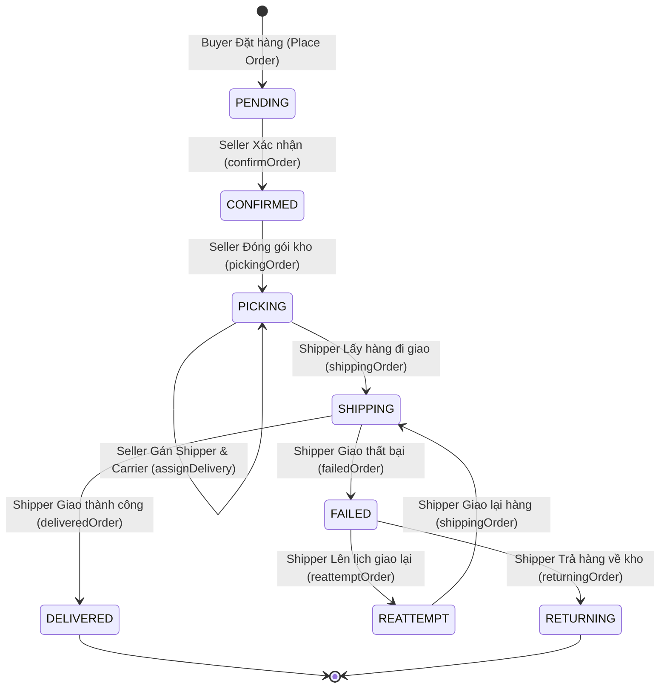

# 📦 Tracking Order - E-Commerce & Order Tracking Service

> Hệ thống quản lý thương mại điện tử, theo dõi hành trình đơn hàng đa vai trò (Buyer, Seller, Shipper) tích hợp cơ chế **Feature Flag** đánh giá cục bộ (Local Snapshot Evaluation).

---

## 📑 Mục lục (Table of Contents)

1. [Giới thiệu tổng quan](#1-giới-thiệu-tổng-quan)
   - [1.1. Tên dự án & Mục đích](#11-tên-dự-án--mục-đích)
   - [1.2. Bài toán giải quyết](#12-bài-toán-giải-quyết)
   - [1.3. Các module nghiệp vụ thực tế trong code](#13-các-module-nghiệp-vụ-thực-tế-trong-code)
2. [Kiến trúc & Công nghệ sử dụng](#2-kiến-trúc--công-nghệ-sử-dụng)
   - [2.1. Tech Stack & Dependencies chính](#21-tech-stack--dependencies-chính)
   - [2.2. Kiến trúc 3 lớp (3-Tier Layered Architecture)](#22-kiến-trúc-3-lớp-3-tier-layered-architecture)
   - [2.3. Cơ chế xác thực & Phân quyền (Security)](#23-cơ-chế-xác-thực--phân-quyền-security)
   - [2.4. Cơ chế Feature Flag](#24-cơ-chế-feature-flag)
3. [Cấu trúc thư mục dự án](#3-cấu-trúc-thư-mục-dự-án)
4. [Cơ sở dữ liệu (Database Schema)](#4-cơ-sở-dữ-liệu-database-schema)
   - [4.1. Thực thể cơ sở dùng chung (BaseEntity)](#41-thực-thể-cơ-sở-dùng-chung-baseentity)
   - [4.2. Danh sách các bảng dữ liệu chính](#42-danh-sách-các-bảng-dữ-liệu-chính)
   - [4.3. Các trạng thái vòng đời đơn hàng (OrderStatusEnum)](#43-các-trạng-thái-vòng-đời-đơn-hàng-orderstatusenum)
5. [Danh mục API Endpoints](#5-danh-mục-api-endpoints)
   - [5.1. Authentication Module (`/api/v1/auth`)](#51-authentication-module-apiv1auth)
   - [5.2. User & Address Module (`/api/v1/users`)](#52-user--address-module-apiv1users)
   - [5.3. Product Module (`/api/v1/products`)](#53-product-module-apiv1products)
   - [5.4. Cart Module (`/api/v1/cart`)](#54-cart-module-apiv1cart)
   - [5.5. Order Module (`/api/v1/orders`)](#55-order-module-apiv1orders)
   - [5.6. Carrier Module (`/api/v1/carriers`)](#56-carrier-module-apiv1carriers)
   - [5.7. Returns Module (`/api/v1/returns`)](#57-returns-module-apiv1returns)
   - [5.8. Product Review Module (`/api/v1/reviews`)](#58-product-review-module-apiv1reviews)
   - [5.9. Feature Flag Client & Internal Sync (`/api/v1/features`, `/api/v1/feature-flags`)](#59-feature-flag-client--internal-sync-apiv1features-apiv1feature-flags)
6. [Hướng dẫn cài đặt & Chạy dự án](#6-hướng-dẫn-cài-đặt--chạy-dự-án)
   - [6.1. Yêu cầu môi trường](#61-yêu-cầu-môi-trường)
   - [6.2. Cấu hình hệ thống](#62-cấu-hình-hệ-thống)
   - [6.3. Khởi tạo Cơ sở dữ liệu](#63-khởi-tạo-cơ-sở-dữ-liệu)
   - [6.4. Cài đặt thư viện cục bộ (Local Jar Dependency)](#64-cài-đặt-thư-viện-cục-bộ-local-jar-dependency)
   - [6.5. Biên dịch & Khởi chạy Backend](#65-biên-dịch--khởi-chạy-backend)
   - [6.6. Chạy với Docker Compose](#66-chạy-với-docker-compose)
7. [Hướng dẫn sử dụng API (Request/Response mẫu)](#7-hướng-dẫn-sử-dụng-api-requestresponse-mẫu)
   - [7.1. Đăng ký & Đăng nhập](#71-đăng-ký--đăng-nhập)
   - [7.2. Thêm địa chỉ nhận hàng](#72-thêm-địa-chỉ-nhận-hàng)
   - [7.3. Thao tác giỏ hàng](#73-thao-tác-giỏ-hàng)
   - [7.4. Tính toán tóm tắt đơn hàng (Order Summary)](#74-tính-toán-tóm-tắt-đơn-hàng-order-summary)
   - [7.5. Đặt hàng (Place Order)](#75-đặt-hàng-place-order)
   - [7.6. Tra cứu lịch sử Tracking đơn hàng](#76-tra-cứu-lịch-sử-tracking-đơn-hàng)
   - [7.7. Quy trình xử lý đơn hàng (Seller & Shipper)](#77-quy-trình-xử-lý-đơn-hàng-seller--shipper)
8. [Trạng thái phát triển (Development Status)](#8-trạng-thái-phát-triển-development-status)
   - [8.1. Các tính năng đã hoàn thiện](#81-các-tính-năng-đã-hoàn-thiện)
   - [8.2. Các tính năng đang dở dang hoặc chưa kết nối](#82-các-tính-năng-đang-dở-dang-hoặc-chưa-kết-nối)
9. [Ghi chú & Đề xuất kỹ thuật (Technical Notes / TODOs)](#9-ghi-chú--đề-xuất-kỹ-thuật-technical-notes--todos)

---

## 1. Giới thiệu tổng quan

### 1.1. Tên dự án & Mục đích
- **Tên dự án:** `tracking-order` (Tracking Order Service)
- **Mục đích:** Cung cấp backend dịch vụ thương mại điện tử cốt lõi, quản lý danh mục sản phẩm, giỏ hàng, đặt hàng, phân công giao hàng và theo dõi nhật ký hành trình đơn hàng chi tiết theo thời gian thực cho từng vai trò người dùng.

### 1.2. Bài toán giải quyết
1. **Quản lý quy trình xử lý đơn hàng đa vai trò (Multi-Role Order Workflow):**
   - **Người mua (BUYER):** Xem sản phẩm, quản lý giỏ hàng, áp mã giảm giá, đặt hàng (`Place Order`), mua nhanh (`Buy Now`), quản lý địa chỉ nhận hàng, theo dõi hành trình đơn hàng và khiếu nại trả hàng/đánh giá sản phẩm.
   - **Người bán (SELLER):** Quản lý danh mục sản phẩm, duyệt đơn (`CONFIRMED`), đóng gói kho (`PICKING`), phân công đơn vị vận chuyển & tài xế (`ASSIGN`), giám sát khiếu nại trả hàng.
   - **Tài xế giao hàng (SHIPPER):** Tiếp nhận đơn giao (`SHIPPING`), xác nhận giao thành công (`DELIVERED`), báo giao thất bại (`FAILED`), yêu cầu hoàn kho (`RETURNING`) hoặc lên lịch giao lại (`REATTEMPT`).
2. **Theo dõi hành trình chi tiết (Order Tracking History):**
   - Tự động ghi nhật ký (`TrackingLog`) mỗi khi đơn hàng có sự chuyển trạng thái, ghi rõ người thực hiện, thời gian, trạng thái trước/sau, tiêu đề hành động, ghi chú và địa điểm thực tế (Warehouse, Delivery Hub, Customer Address...).
3. **Tích hợp Feature Flag cục bộ (Local Snapshot Evaluation):**
   - Cho phép bật/tắt động tính năng (ví dụ `BUY_NOW`, `ORDER_DETAIL`, chiến lược tăng giá `PRICE_INCREASE`) tức thì với độ trễ xấp xỉ **0ms**, không làm gián đoạn hệ thống và không phát sinh cuộc gọi mạng chéo (cross-service call) lúc runtime.
   - Tự động nạp cấu hình cờ qua luồng file (`/api/v1/feature-flags/sync-file`) từ Central Control Plane.

### 1.3. Các module nghiệp vụ thực tế trong code
Dựa trên kiểm tra trực tiếp source code, các module sau **thực sự tồn tại** và có logic nghiệp vụ:
- ✅ **Auth & Identity:** Đăng ký tài khoản, đăng nhập JWT, làm mới token, phân quyền 3 roles (`BUYER`, `SELLER`, `SHIPPER`), snapshot cờ tính năng theo phiên đăng nhập.
- ✅ **User & Address:** Hồ sơ người dùng cá nhân, danh sách sổ địa chỉ giao hàng (`UserAddress`), thiết lập địa chỉ mặc định, tự động khởi tạo giỏ hàng rỗng khi đăng ký tài khoản `BUYER`.
- ✅ **Product & Catalog:** Danh sách sản phẩm, chi tiết sản phẩm kèm các biến thể (`ProductVariant`), xem danh mục dành riêng cho Buyer hoặc Seller (`/admin`).
- ✅ **Cart (Giỏ hàng):** Xem giỏ hàng cá nhân, thêm biến thể sản phẩm vào giỏ, cập nhật số lượng hoặc xóa khỏi giỏ, tự động tính trạng thái tồn kho hiển thị (`IN_STOCK`, `LIMITED_STOCK`, `OUT_OF_STOCK`).
- ✅ **Order & Checkout:** Tính toán tóm tắt thanh toán (`summary`), tạo đơn hàng (`placeOrder`), Mua ngay (`buyNow`), xem danh sách đơn hàng đã mua (`my-orders`), chi tiết đơn hàng, và toàn bộ máy trạng thái duyệt/giao hàng cho Seller và Shipper.
- ✅ **Carrier & Shipper:** Quản lý đơn vị vận chuyển (`Carrier`), kích hoạt / vô hiệu hóa đơn vị vận chuyển, quản lý danh sách shipper theo từng hãng vận chuyển.
- ✅ **Tracking Log:** Quản lý lịch sử thay đổi trạng thái đơn hàng xuyên suốt chu trình giao vận.
- ✅ **Coupon (Mã giảm giá):** Tầng Service xử lý logic tính giảm giá (cố định `FIXED` hoặc phần trăm `PERCENT`), kiểm tra hạn dùng, kiểm tra giới hạn lượt dùng tối đa, giá trị đơn tối thiểu, cập nhật tăng số lượt đã dùng khi đơn đặt thành công.
- ✅ **Returns (Trả hàng / Khiếu nại):** Tạo yêu cầu trả hàng từ Buyer, tra cứu theo user/order, danh sách yêu cầu trả hàng cho Seller, cập nhật trạng thái xử lý khiếu nại.
- ✅ **Product Review (Đánh giá sản phẩm):** Cho phép Buyer gửi đánh giá rating (1-5 sao) và bình luận cho sản phẩm, tra cứu theo sản phẩm hoặc người dùng.
- ✅ **Feature Flag Engine:** Đánh giá cờ bằng client in-memory (`FeatureFlagClient`), chặn API bằng AOP aspect `@RequireFeature`, trả snapshot cờ khi đăng nhập và endpoint nội bộ tiếp nhận đồng bộ file snapshot.

*(Lưu ý: Các module như thanh toán trực tuyến qua cổng VNPAY/MOMO, tính phí ship động theo khoảng cách/địa chỉ, CRUD sản phẩm của Seller chỉ mới có khung entity/enum/repository hoặc giá trị giả định hardcoded, chưa có Controller/Service hoàn chỉnh).*

---

## 2. Kiến trúc & Công nghệ sử dụng

### 2.1. Tech Stack & Dependencies chính
Toàn bộ thông tin được trích xuất trực tiếp từ file [pom.xml](file:///d:/Code/tracking-order/pom.xml):

| Thành phần / Thư viện | Phiên bản | Nhóm / Artifact ID | Mục đích sử dụng |
| :--- | :--- | :--- | :--- |
| **Java Platform** | **21** | `java.version: 21` | Ngôn ngữ nền tảng (LTS) |
| **Spring Boot** | **4.1.0** | `org.springframework.boot:spring-boot-starter-parent` | Framework nền tảng của ứng dụng |
| **Spring Data JPA** | 4.1.0 (starter) | `spring-boot-starter-data-jpa` | Quản lý ORM & tương tác CSDL qua Hibernate |
| **Spring Web MVC** | 4.1.0 (starter) | `spring-boot-starter-webmvc` | Xây dựng RESTful API controllers |
| **Spring Security** | 4.1.0 (starter) | `spring-boot-starter-security` | Xác thực, bảo mật và phân quyền API |
| **Spring Validation** | 4.1.0 | `spring-boot-starter-validation` | Kiểm tra tính hợp lệ dữ liệu request (Jakarta Bean Validation) |
| **Spring AOP** | 4.1.0 (starter) | `spring-boot-starter-aspectj` | Hỗ trợ Aspect-Oriented Programming (chặn cờ `@RequireFeature`) |
| **MySQL Connector** | **8.0.33** | `mysql:mysql-connector-java` | Driver kết nối CSDL MySQL 8.0 |
| **MapStruct** | **1.6.3** | `org.mapstruct:mapstruct` & `mapstruct-processor` | Ánh xạ đối tượng Entity $\leftrightarrow$ DTO tại thời điểm biên dịch |
| **Lombok** | Managed | `org.projectlombok:lombok` | Tự động sinh getter/setter/builder/constructors |
| **Jackson Databind** | Managed | `com.fasterxml.jackson.core:jackson-databind` | Xử lý tuần tự hóa/giải tuần tự hóa JSON và InputStream |
| **JJWT (Java JWT)** | **0.12.6** | `io.jsonwebtoken:jjwt-api`, `jjwt-impl`, `jjwt-jackson` | Sinh, phân tích cú pháp và xác thực JSON Web Token |
| **Feature Flag Lib** | **1.0.0** | `com.example:feature-flag-lib` | Thư viện Feature Flag tùy biến đánh giá cờ cục bộ |
| **Spring DevTools** | 4.0.6 | `spring-boot-devtools` | Hỗ trợ hot-reload môi trường phát triển |
| **Maven Compiler Plugin** | 3.13.0 | `org.apache.maven.plugins:maven-compiler-plugin` | Biên dịch Java 21, xử lý song song annotation Lombok & MapStruct |

### 2.2. Kiến trúc 3 lớp (3-Tier Layered Architecture)
Dự án tuân thủ nghiêm ngặt mô hình kiến trúc phân lớp hướng đối tượng:
1. **Presentation Layer (Controller):**
   - Chứa 10 `@RestController`.
   - Tiếp nhận HTTP requests, xử lý kiểm tra định dạng `@Valid`, bắt quyền hạn qua `@PreAuthorize`, gọi Service tương ứng và trả về `ResponseEntity<DTO>`.
2. **Business Logic Layer (Service & ServiceImpl):**
   - Gồm 12 Service Interfaces và 12 Service Implementations.
   - Đảm nhận toàn bộ nghiệp vụ: kiểm tra tồn kho, tính toán giảm giá, chuyển đổi trạng thái đơn hàng, ghi log tracking tự động, xử lý giao dịch cơ sở dữ liệu (`@Transactional`).
   - Tích hợp kiểm tra Feature Flag bằng annotation `@RequireFeature` hoặc gọi trực tiếp `featureFlagClient.isEnabled(...)`.
3. **Data Access Layer (Repository):**
   - Gồm 16 Spring Data JPA Repositories kế thừa `JpaRepository`.
   - Thực thi các câu lệnh JPQL fetch join tối ưu tránh lỗi N+1 (ví dụ `findOrderDetail`, `findAllByUser`), khóa bản ghi đọc `findByCodeReadOnly` cho Coupon, và phân trang `Pageable`.

```
[ Client / Frontend ]
         │ (HTTP / JSON / Bearer Token)
         ▼
[ Security Filter Chain: JwtAuthenticationFilter ]
         │ (Authenticated SecurityContext)
         ▼
[ Presentation Layer: @RestController ]
         │ (Request DTOs)
         ▼
[ Business Logic Layer: Service / ServiceImpl ] ◄──► [ FeatureFlagClient (In-Memory) ]
         │ (Entities via MapStruct Mappers)
         ▼
[ Data Access Layer: Spring Data JPA Repository ]
         │ (JPQL / SQL Queries)
         ▼
[ Database: MySQL 8.0 ]
```

### 2.3. Cơ chế xác thực & Phân quyền (Security)
*Dựa trên việc phân tích trực tiếp file [SecurityConfig.java](file:///d:/Code/tracking-order/src/main/java/com/example/trackingorder/config/jwt/SecurityConfig.java) và [JwtAuthenticationFilter.java](file:///d:/Code/tracking-order/src/main/java/com/example/trackingorder/config/jwt/JwtAuthenticationFilter.java):*

- **Cơ chế xác thực:** **JWT (JSON Web Token) - Hoàn toàn không lưu trạng thái (Stateless)**.
  - Cấu hình session: `SessionCreationPolicy.STATELESS`.
  - Filter bảo vệ: `JwtAuthenticationFilter` được gắn trước `UsernamePasswordAuthenticationFilter`. Filter này đọc `Authorization: Bearer <token>`, trích xuất username, xác thực chữ ký HMAC-SHA256, nạp thông tin quyền vào `SecurityContextHolder`.
  - Thời hạn Token:
    - **Access Token:** `300,000 ms` (**5 phút**). Chứa claims: `sub` (username), `role`, `userId`.
    - **Refresh Token:** `604,800,000 ms` (**7 ngày**). Dùng để xin cấp lại Access Token mới qua API `/api/v1/auth/refresh`.
  - Mật khẩu người dùng được mã hóa an toàn bằng `BCryptPasswordEncoder`.
  - Xử lý lỗi xác thực: `JwtAuthenticationEntryPoint` trả về HTTP 401 Unauthorized khi token không hợp lệ hoặc thiếu token.
  - Phân quyền theo vai trò (Role-Based Access Control): Bật `@EnableMethodSecurity`. Các role trong hệ thống gồm `BUYER`, `SELLER`, `SHIPPER` (khi gán quyền trong Spring Security sẽ tự động chuẩn hóa tiền tố `ROLE_BUYER`, `ROLE_SELLER`, `ROLE_SHIPPER`).
- **Danh sách URL công khai không cần Token (`permitAll`):**
  - `/api/v1/auth/**` (Đăng nhập, làm mới token)
  - `/api/v1/users/register` (Đăng ký tài khoản)
  - `/api/v1/feature-flags/**` (Endpoint giao tiếp nội bộ qua header `X-Internal-Token`)
  - `/error` (Trang lỗi mặc định của Spring Boot)
- **Tất cả các endpoint còn lại (`anyRequest().authenticated()`):** Bắt buộc phải có Bearer Token hợp lệ.

### 2.4. Cơ chế Feature Flag
Hệ thống sử dụng thư viện `feature-flag-lib` với kiến trúc đánh giá cờ cục bộ (Local Snapshot):
1. **Đồng bộ cấu hình cờ (Sync):** Admin hoặc Tenant Flag Service đẩy file snapshot cờ sang `tracking-order` qua endpoint `POST /api/v1/feature-flags/sync-file` (sử dụng HTTP Multipart Streaming và bảo vệ bằng header `X-Internal-Token`). Cấu hình cờ được nạp thẳng vào bộ nhớ in-memory.
2. **Kiểm tra cờ lúc runtime (Evaluation):**
   - **Qua AOP Annotation:** `@RequireFeature(features = "BUY_NOW")` hoặc `@RequireFeature(features = "ORDER_DETAIL")` đặt trước phương thức Service. Nếu cờ bị tắt đối với user hiện tại, hệ thống ném `FeatureFlagDisabledException` và trả về lỗi HTTP 403 Forbidden.
   - **Qua Code trực tiếp:** `featureFlagClient.isEnabled("PRICE_INCREASE")` áp dụng điều chỉnh tăng 10% đơn giá sản phẩm trong khâu tính tiền (`OrderServiceImpl`).
3. **Session Snapshot:** Khi user đăng nhập thành công (`/api/v1/auth/login`) hoặc làm mới token, `featureFlagClient.evaluateAll()` sẽ tính toán trước toàn bộ trạng thái cờ cho user đó và trả về trong đối tượng `AuthRes.features` (Map<String, Boolean>) để Frontend ẩn/hiện nút tương ứng ngay trên giao diện.

---

## 3. Cấu trúc thư mục dự án

```
tracking-order/
├── Database/                               # Thư mục chứa tài nguyên CSDL
│   ├── diagram.mwb                         # Sơ đồ quan hệ thực thể MySQL Workbench
│   └── tracking_order.sql                  # Script DDL khởi tạo toàn bộ bảng & dữ liệu mẫu
├── docs/                                   # Tài liệu dự án
│   └── architecture/
│       └── feature-flag-c4.md              # Tài liệu kiến trúc C4 Model của hệ thống Feature Flag
├── Frontend/                               # Ứng dụng giao diện web (React/Vite)
├── libs/                                   # Thư viện ngoài dạng jar cục bộ
│   └── feature-flag-lib-1.0.0.jar          # File JAR thư viện Feature Flag
├── src/
│   ├── main/
│   │   ├── java/com/example/trackingorder/
│   │   │   ├── TrackingOrderApplication.java   # Class chứa hàm main khởi chạy Spring Boot
│   │   │   │
│   │   │   ├── common/                     # Định nghĩa các hằng số, Enum dùng chung
│   │   │   │   ├── DiscountTypeEnum.java   # Loại giảm giá (PERCENT, FIXED)
│   │   │   │   ├── OrderStatusEnum.java    # Trạng thái đơn hàng (PENDING -> DELIVERED...)
│   │   │   │   ├── OriginType.java         # Nguồn gốc yêu cầu trả hàng (CUSTOMER, CARRIER)
│   │   │   │   ├── PaymentMethodStatus.java# Trạng thái thanh toán (UNPAID, PAID...)
│   │   │   │   ├── PaymentMethodType.java  # Phương thức thanh toán (COD, VNPAY, MOMO)
│   │   │   │   ├── PaymentType.java        # Loại thanh toán đơn hàng (COD, ONLINE)
│   │   │   │   ├── ReasonEnum.java         # Lý do trả hàng (DAMAGED, WRONG_ITEM...)
│   │   │   │   ├── RoleEnum.java           # Vai trò người dùng (BUYER, SELLER, SHIPPER)
│   │   │   │   ├── StatusReturnEnum.java   # Trạng thái đơn trả (PENDING, APPROVED...)
│   │   │   │   ├── StatusShipperEnum.java  # Trạng thái hoạt động của Shipper
│   │   │   │   ├── StockStatusEnum.java    # Trạng thái tồn kho (IN_STOCK, OUT_OF_STOCK...)
│   │   │   │   └── UserStatusEnum.java     # Trạng thái tài khoản (ACTIVE, INACTIVE)
│   │   │   │
│   │   │   ├── config/                     # Cấu hình Spring Context
│   │   │   │   ├── JacksonConfig.java      # Cấu hình Jackson ObjectMapper
│   │   │   │   ├── JpaAuditingConfig.java  # Tự động ghi nhận createdBy, updatedBy qua AuditorAware
│   │   │   │   ├── basicauthconfig/        # (Tên gói cũ) Chứa Facade lấy User hiện tại
│   │   │   │   │   ├── AuthenticationFacade.java # Lấy User Entity từ SecurityContextHolder
│   │   │   │   │   └── CustomUserDetailService.java # Cung cấp UserDetails cho AuthenticationManager
│   │   │   │   └── jwt/                    # Cấu hình xác thực JWT chính của hệ sinh thái
│   │   │   │       ├── JwtAuthenticationEntryPoint.java # Xử lý trả lỗi 401 Unauthorized
│   │   │   │       ├── JwtAuthenticationFilter.java     # Filter chặn request đọc Bearer token
│   │   │   │       ├── JwtProperties.java               # Map thuộc tính jwt.* từ application.yaml
│   │   │   │       ├── JwtTokenProvider.java            # Khởi tạo và parse JWT token
│   │   │   │       └── SecurityConfig.java              # Cấu hình SecurityFilterChain & CORS
│   │   │   │
│   │   │   ├── configmapper/               # Các mapper MapStruct Entity <-> DTO
│   │   │   │   ├── CarrierMapper.java
│   │   │   │   ├── CartItemMapper.java
│   │   │   │   ├── OrderItemMapper.java
│   │   │   │   ├── OrderMapper.java
│   │   │   │   ├── ProductMapper.java
│   │   │   │   ├── ProductReviewMapper.java
│   │   │   │   ├── ProductVariantMapper.java
│   │   │   │   ├── ReturnMapper.java
│   │   │   │   ├── SellerOrderDetailMapper.java
│   │   │   │   ├── SellerOrderItemMapper.java
│   │   │   │   ├── SellerOrderMapper.java
│   │   │   │   ├── ShipperMapper.java
│   │   │   │   ├── TrackingLogMapper.java
│   │   │   │   └── UserAddressMapper.java
│   │   │   │
│   │   │   ├── controller/                 # Tầng Presentation tiếp nhận HTTP REST API
│   │   │   │   ├── AuthController.java     # /api/v1/auth (Login, Refresh, Me)
│   │   │   │   ├── CarrierController.java  # /api/v1/carriers (Quản lý đơn vị vận chuyển)
│   │   │   │   ├── CartController.java     # /api/v1/cart (Giỏ hàng cá nhân)
│   │   │   │   ├── FeatureController.java  # /api/v1/features (Đánh giá cờ & debug client)
│   │   │   │   ├── InternalFeatureFlagController.java # /api/v1/feature-flags (Đồng bộ snapshot)
│   │   │   │   ├── OrderController.java    # /api/v1/orders (Toàn bộ chu trình đơn hàng)
│   │   │   │   ├── ProductController.java  # /api/v1/products (Tra cứu danh mục sản phẩm)
│   │   │   │   ├── ProductReviewController.java # /api/v1/reviews (Đánh giá sản phẩm)
│   │   │   │   ├── ReturnController.java   # /api/v1/returns (Khiếu nại đổi trả hàng)
│   │   │   │   └── UserController.java     # /api/v1/users (Hồ sơ & Sổ địa chỉ người dùng)
│   │   │   │
│   │   │   ├── dto/                        # Đối tượng truyền dữ liệu (Data Transfer Objects)
│   │   │   │   ├── request/                # Chứa 15 Request DTOs
│   │   │   │   └── response/               # Chứa 32 Response DTOs
│   │   │   │
│   │   │   ├── entity/                     # Các JPA Entity tương ứng với các bảng MySQL
│   │   │   │   ├── BaseEntity.java         # Lớp cha chứa audit fields và cờ deleted
│   │   │   │   ├── Carrier.java            # Đơn vị vận chuyển
│   │   │   │   ├── Cart.java               # Giỏ hàng
│   │   │   │   ├── CartItem.java           # Chi tiết mặt hàng trong giỏ
│   │   │   │   ├── Coupon.java             # Mã khuyến mãi giảm giá
│   │   │   │   ├── Inventory.java          # Tồn kho theo biến thể
│   │   │   │   ├── Order.java              # Đơn đặt hàng
│   │   │   │   ├── OrderItem.java          # Chi tiết mặt hàng trong đơn
│   │   │   │   ├── PaymentMethod.java      # Phương thức thanh toán đơn hàng
│   │   │   │   ├── Product.java            # Sản phẩm gốc
│   │   │   │   ├── ProductCategory.java    # Danh mục sản phẩm
│   │   │   │   ├── ProductReview.java      # Bình luận & Đánh giá sao
│   │   │   │   ├── ProductVariant.java     # Biến thể sản phẩm (màu, size, sku)
│   │   │   │   ├── Return.java             # Yêu cầu hoàn/trả hàng
│   │   │   │   ├── Shipper.java            # Tài xế giao hàng
│   │   │   │   ├── ShippingFee.java        # Biểu phí vận chuyển
│   │   │   │   ├── TrackingLog.java        # Nhật ký hành trình giao hàng
│   │   │   │   ├── User.java               # Tài khoản người dùng
│   │   │   │   └── UserAddress.java        # Sổ địa chỉ giao hàng
│   │   │   │
│   │   │   ├── exception/                  # Xử lý lỗi & Ngoại lệ tập trung
│   │   │   │   ├── BadRequestException.java# Ngoại lệ HTTP 400
│   │   │   │   ├── ErrorRes.java           # Cấu trúc JSON trả về khi gặp lỗi
│   │   │   │   ├── ForbiddenException.java # Ngoại lệ HTTP 403
│   │   │   │   ├── NotFoundException.java  # Ngoại lệ HTTP 404
│   │   │   │   └── RestExceptionHandler.java # @ControllerAdvice bắt ngoại lệ toàn ứng dụng
│   │   │   │
│   │   │   ├── repository/                 # Giao tiếp cơ sở dữ liệu qua Spring Data JPA
│   │   │   │   └── (16 Repository interfaces tương ứng cho từng Entity)
│   │   │   │
│   │   │   └── service/                    # Tầng nghiệp vụ (Interfaces & Implementations)
│   │   │       ├── AuthService.java / AuthServiceImpl.java
│   │   │       ├── CarrierOrderService.java / CarrierOrderServiceImpl.java
│   │   │       ├── CarrierService.java / CarrierServiceImpl.java
│   │   │       ├── CartService.java / CartServiceImpl.java
│   │   │       ├── CouponService.java / CouponServiceImpl.java
│   │   │       ├── FeatureService.java / FeatureServiceImpl.java
│   │   │       ├── OrderService.java / OrderServiceImpl.java
│   │   │       ├── ProductReviewService.java / ProductReviewServiceImpl.java
│   │   │       ├── ProductService.java / ProductServiceImpl.java
│   │   │       ├── ReturnService.java / ReturnServiceImpl.java
│   │   │       ├── TrackingLogService.java / TrackingLogServiceImpl.java
│   │   │       └── UserService.java / UserServiceImpl.java
│   │   │
│   │   └── resources/
│   │       └── application.yaml            # Cấu hình CSDL, JWT, Token đồng bộ cờ, log level
│   │
│   └── test/                               # Thư mục kiểm thử tự động
├── docker-compose.yml                      # Định nghĩa cụm container môi trường Multi-Tenant
├── Dockerfile                              # Cấu hình build Docker image cho backend
└── pom.xml                                 # Quản lý dependency Maven của dự án
```

---

## 4. Cơ sở dữ liệu (Database Schema)

### 4.1. Thực thể cơ sở dùng chung (BaseEntity)
Mọi Entity trong hệ thống (trừ các bảng thuần liên kết) đều kế thừa từ [BaseEntity.java](file:///d:/Code/tracking-order/src/main/java/com/example/trackingorder/entity/BaseEntity.java), cung cấp sẵn cơ chế Audit Fields và Soft Delete tự động:

| Tên trường (Java / DB Column) | Kiểu dữ liệu | Chức năng & Ghi chú |
| :--- | :--- | :--- |
| `createdAt` (`create_at`) | `DATETIME` | Thời điểm tạo bản ghi, tự động sinh bởi `@CreatedDate` |
| `updatedAt` (`update_at`) | `DATETIME` | Thời điểm cập nhật cuối, tự động sinh bởi `@LastModifiedDate` |
| `createdBy` (`created_by`) | `VARCHAR(255)` | Username của người tạo bản ghi (lấy tự động từ SecurityContext qua `AuditorAware`) |
| `updatedBy` (`updated_by`) | `VARCHAR(255)` | Username của người cập nhật bản ghi cuối cùng |
| `deleted` (`deleted`) | `TINYINT(1)` / `boolean` | Cờ xóa mềm (Soft-delete): `0` = Đang hoạt động, `1` = Đã xóa |

### 4.2. Danh sách các bảng dữ liệu chính

| STT | Tên bảng (Table Name) | Entity Class tương ứng | Mô tả chức năng |
| :---: | :--- | :--- | :--- |
| 1 | `users` | [User.java](file:///d:/Code/tracking-order/src/main/java/com/example/trackingorder/entity/User.java) | Lưu tài khoản đăng nhập, số điện thoại, mật khẩu mã hóa BCrypt, vai trò (`role`) và trạng thái (`status`). |
| 2 | `user_addresses` | [UserAddress.java](file:///d:/Code/tracking-order/src/main/java/com/example/trackingorder/entity/UserAddress.java) | Sổ địa chỉ nhận hàng của người mua, gồm tỉnh/thành, quận/huyện, địa chỉ chi tiết và cờ mặc định `is_default`. |
| 3 | `product_categories` | [ProductCategory.java](file:///d:/Code/tracking-order/src/main/java/com/example/trackingorder/entity/ProductCategory.java) | Danh mục phân loại sản phẩm, hỗ trợ mô hình đa cấp cha - con (`parent_id`). |
| 4 | `products` | [Product.java](file:///d:/Code/tracking-order/src/main/java/com/example/trackingorder/entity/Product.java) | Thông tin sản phẩm gốc: tên, mô tả, giá cơ sở `base_price`, trọng lượng `weight_gram`, người bán `seller_id`. |
| 5 | `product_variants` | [ProductVariant.java](file:///d:/Code/tracking-order/src/main/java/com/example/trackingorder/entity/ProductVariant.java) | Các biến thể của sản phẩm (màu sắc/size), mã SKU, độ chênh lệch giá `price_modifier`. |
| 6 | `inventories` | [Inventory.java](file:///d:/Code/tracking-order/src/main/java/com/example/trackingorder/entity/Inventory.java) | Quản lý kho hàng theo từng biến thể: số lượng tồn `quantity_in_stock`, vị trí kho `warehouse_location`. |
| 7 | `carts` | [Cart.java](file:///d:/Code/tracking-order/src/main/java/com/example/trackingorder/entity/Cart.java) | Giỏ hàng của người dùng (quan hệ 1-1 với `User`). |
| 8 | `cart_items` | [CartItem.java](file:///d:/Code/tracking-order/src/main/java/com/example/trackingorder/entity/CartItem.java) | Từng món hàng trong giỏ, gắn với `ProductVariant` và số lượng `quantity`. |
| 9 | `orders` | [Order.java](file:///d:/Code/tracking-order/src/main/java/com/example/trackingorder/entity/Order.java) | Bảng đơn hàng trung tâm: lưu thông tin khách hàng, địa chỉ, đơn vị vận chuyển, shipper, tổng tiền, mã tracking, trạng thái. |
| 10 | `order_items` | [OrderItem.java](file:///d:/Code/tracking-order/src/main/java/com/example/trackingorder/entity/OrderItem.java) | Chi tiết các mặt hàng trong đơn đã chốt, lưu snapshot `unit_price` và số lượng tại thời điểm đặt hàng. |
| 11 | `carriers` | [Carrier.java](file:///d:/Code/tracking-order/src/main/java/com/example/trackingorder/entity/Carrier.java) | Hãng vận chuyển (Giao Hàng Nhanh, Viettel Post...), API endpoint, danh sách vùng hỗ trợ, cờ kích hoạt `is_active`. |
| 12 | `shipper` | [Shipper.java](file:///d:/Code/tracking-order/src/main/java/com/example/trackingorder/entity/Shipper.java) | Thông tin tài xế giao hàng, liên kết với tài khoản `User` (role SHIPPER) và hãng `Carrier`. |
| 13 | `shipping_fees` | [ShippingFee.java](file:///d:/Code/tracking-order/src/main/java/com/example/trackingorder/entity/ShippingFee.java) | Định mức cước vận chuyển theo khoảng cân nặng, vùng miền, phí cơ bản và ngưỡng miễn phí vận chuyển. |
| 14 | `tracking_logs` | [TrackingLog.java](file:///d:/Code/tracking-order/src/main/java/com/example/trackingorder/entity/TrackingLog.java) | Nhật ký từng bước di chuyển của đơn: người cập nhật `update_by`, trạng thái trước `from_status`, trạng thái sau `to_status`, tiêu đề, ghi chú, vị trí và timestamp. |
| 15 | `coupons` | [Coupon.java](file:///d:/Code/tracking-order/src/main/java/com/example/trackingorder/entity/Coupon.java) | Mã giảm giá khuyến mãi: mã code, loại (`PERCENT`/`FIXED`), giá trị giảm, giá trị đơn tối thiểu, hạn dùng, giới hạn lượt dùng tối đa và số lượt đã dùng. |
| 16 | `returns` | [Return.java](file:///d:/Code/tracking-order/src/main/java/com/example/trackingorder/entity/Return.java) | Đơn khiếu nại trả hàng: gắn với đơn hàng, lý do (`DAMAGED`, `WRONG_ITEM`...), nguồn gốc phát sinh (`CUSTOMER`, `CARRIER`), trạng thái trả hàng, số tiền hoàn trả. |
| 17 | `product_reviews` | [ProductReview.java](file:///d:/Code/tracking-order/src/main/java/com/example/trackingorder/entity/ProductReview.java) | Đánh giá sản phẩm: điểm số rating từ 1 đến 5 sao, nội dung bình luận của người mua. |
| 18 | `payment_methods` | [PaymentMethod.java](file:///d:/Code/tracking-order/src/main/java/com/example/trackingorder/entity/PaymentMethod.java) | Thông tin thanh toán đơn hàng: loại (`COD`, `VNPAY`, `MOMO`), mã giao dịch `transaction_id`, trạng thái (`UNPAID`, `PAID`...). |

### 4.3. Các trạng thái vòng đời đơn hàng (OrderStatusEnum)
Theo định nghĩa trong [OrderStatusEnum.java](file:///d:/Code/tracking-order/src/main/java/com/example/trackingorder/common/OrderStatusEnum.java) và luồng nghiệp vụ trong [OrderServiceImpl.java](file:///d:/Code/tracking-order/src/main/java/com/example/trackingorder/service/impl/OrderServiceImpl.java):



---

## 5. Danh mục API Endpoints

Hệ thống cung cấp tổng cộng **50 API Endpoints** được chia theo từng module như dưới đây:

### 5.1. Authentication Module (`/api/v1/auth`)
Quản lý xác thực người dùng bằng JWT và cung cấp danh sách Feature Flags tương ứng với session.

| Method | Endpoint Path | Mô tả nghiệp vụ | Quyền truy cập | Request DTO | Response DTO |
| :---: | :--- | :--- | :---: | :--- | :--- |
| `POST` | `/api/v1/auth/login` | Đăng nhập tài khoản, cấp Access Token, Refresh Token, User Profile & Snapshot Feature Flags | Public | `LoginReq` | `AuthRes` |
| `POST` | `/api/v1/auth/refresh` | Cấp Access Token mới khi token cũ hết hạn (dùng Refresh Token) | Public | `RefreshTokenReq` | `AuthRes` |
| `GET` | `/api/v1/auth/me` | Lấy thông tin user hiện tại và snapshot trạng thái các Feature Flags | Authenticated | *None* | `AuthRes` |

### 5.2. User & Address Module (`/api/v1/users`)
Quản lý đăng ký tài khoản, xem profile và quản lý sổ địa chỉ giao hàng.

| Method | Endpoint Path | Mô tả nghiệp vụ | Quyền truy cập | Request DTO / Param | Response DTO |
| :---: | :--- | :--- | :---: | :--- | :--- |
| `POST` | `/api/v1/users/register` | Đăng ký tài khoản mới (tự động tạo giỏ hàng nếu role là `BUYER`) | Public | `RegisterReq` | `UserProfileRes` |
| `GET` | `/api/v1/users/me` | Xem thông tin hồ sơ tài khoản hiện tại | `BUYER`, `SELLER`, `SHIPPER` | *None* | `UserProfileRes` |
| `GET` | `/api/v1/users/me/addresses` | Lấy danh sách sổ địa chỉ nhận hàng của người mua | `BUYER` | *None* | `List<UserAddressRes>` |
| `POST` | `/api/v1/users/me/addresses` | Thêm mới địa chỉ nhận hàng | `BUYER` | `CreateUserAddressReq` | `UserAddressRes` |
| `DELETE` | `/api/v1/users/me/addresses/{addressId}` | Xóa một địa chỉ nhận hàng | `BUYER` | Path: `addressId` | `Void` (204 No Content) |
| `PATCH` | `/api/v1/users/me/addresses/{addressId}/default` | Đặt một địa chỉ làm địa chỉ giao hàng mặc định | `BUYER` | Path: `addressId` | `UserAddressRes` |

### 5.3. Product Module (`/api/v1/products`)
Xem danh mục sản phẩm và thông tin biến thể.

| Method | Endpoint Path | Mô tả nghiệp vụ | Quyền truy cập | Request / Param | Response DTO |
| :---: | :--- | :--- | :---: | :--- | :--- |
| `GET` | `/api/v1/products` | Xem danh sách tất cả sản phẩm đang có | `BUYER`, `SELLER` | *None* | `List<ProductRes>` |
| `GET` | `/api/v1/products/admin` | Xem danh sách sản phẩm quản trị kèm đầy đủ biến thể | `SELLER` | *None* | `List<ProductDetailRes>` |
| `GET` | `/api/v1/products/{id}` | Xem chi tiết sản phẩm theo ID kèm các biến thể (variants) | `BUYER`, `SELLER` | Path: `id` | `ProductDetailRes` |

### 5.4. Cart Module (`/api/v1/cart`)
Quản lý giỏ hàng của Buyer.

| Method | Endpoint Path | Mô tả nghiệp vụ | Quyền truy cập | Request DTO | Response DTO |
| :---: | :--- | :--- | :---: | :--- | :--- |
| `GET` | `/api/v1/cart` | Lấy thông tin giỏ hàng hiện tại kèm trạng thái kho (`IN_STOCK`, `LIMITED_STOCK`, `OUT_OF_STOCK`) | `BUYER` | *None* | `CartRes` |
| `POST` | `/api/v1/cart/items` | Thêm sản phẩm biến thể vào giỏ hàng (kiểm tra tồn kho) | `BUYER` | `AddToCartReq` | `CartRes` |
| `PATCH` | `/api/v1/cart/items` | Cập nhật số lượng mặt hàng trong giỏ (số lượng = 0 thì tự động xóa khỏi giỏ) | `BUYER` | `UpdateCartReq` | `CartRes` |

### 5.5. Order Module (`/api/v1/orders`)
Module trung tâm điều phối toàn bộ vòng đời đơn hàng cho cả 3 vai trò.

| Method | Endpoint Path | Mô tả nghiệp vụ | Quyền truy cập | Request DTO / Param | Response DTO |
| :---: | :--- | :--- | :---: | :--- | :--- |
| `POST` | `/api/v1/orders/summary` | Tính toán tiền tạm tính, chiết khấu coupon, phí ship & tổng thanh toán trước khi đặt | `BUYER` | `OrderSummaryReq` | `OrderSummaryRes` |
| `POST` | `/api/v1/orders` | Đặt hàng chính thức: trừ tồn kho, tăng lượt dùng coupon, xóa giỏ hàng & tạo log tracking | `BUYER` | `PlaceOrderReq` | `PlaceOrderRes` |
| `POST` | `/api/v1/orders/buy-now` | Mua ngay sản phẩm *(Bảo vệ bởi cờ `@RequireFeature(BUY_NOW)`)* | `BUYER` | `BuyNowReq` | `BuyNowRes` |
| `GET` | `/api/v1/orders/my-orders` | Xem danh sách đơn hàng đã mua của tôi | `BUYER` | *None* | `List<MyOrderRes>` |
| `GET` | `/api/v1/orders/{orderId}` | Xem chi tiết đơn hàng của người mua *(Bảo vệ bởi cờ `@RequireFeature(ORDER_DETAIL)`)* | `BUYER` | Path: `orderId` | `OrderDetailRes` |
| `GET` | `/api/v1/orders/{orderId}/tracking` | Xem lịch sử hành trình chi tiết của đơn hàng (Tracking timeline) | `BUYER` | Path: `orderId` | `List<TrackingHistoryRes>` |
| `PATCH` | `/api/v1/orders/{orderId}/comfirm` | Seller duyệt đơn: chuyển trạng thái từ `PENDING` $\rightarrow$ `CONFIRMED` *(Lưu ý: URL có typo `comfirm` trong code)* | `SELLER` | Path: `orderId` | `ConfirmOrderRes` |
| `PATCH` | `/api/v1/orders/{orderId}/picking` | Seller đóng gói kho: chuyển từ `CONFIRMED` $\rightarrow$ `PICKING` | `SELLER` | Path: `orderId` | `PickingOrderRes` |
| `PATCH` | `/api/v1/orders/{orderId}/assign` | Seller gán Carrier và Shipper cho đơn hàng đang ở trạng thái `PICKING` | `SELLER` | Path: `orderId`, Body: `AssignDeliveryReq` | `AssignDeliveryRes` |
| `GET` | `/api/v1/orders/seller` | Seller xem danh sách tất cả các đơn hàng (có phân trang) | `SELLER` | Query: `pageSize` (def: 5), `pageNumber` (def: 1) | `Page<SellerOrderRes>` |
| `GET` | `/api/v1/orders/seller/{orderId}` | Seller xem chi tiết đơn hàng kèm toàn bộ lịch sử tracking | `SELLER` | Path: `orderId` | `SellerOrderDetailRes` |
| `PATCH` | `/api/v1/orders/{orderId}/shipping` | Shipper nhận hàng đi giao: chuyển từ `PICKING` hoặc `REATTEMPT` $\rightarrow$ `SHIPPING` | `SHIPPER` | Path: `orderId` | `ShippingOrderRes` |
| `PATCH` | `/api/v1/orders/{orderId}/deliver` | Shipper xác nhận giao hàng thành công: `SHIPPING` $\rightarrow$ `DELIVERED` | `SHIPPER` | Path: `orderId` | `DeliveredOrderRes` |
| `PATCH` | `/api/v1/orders/{orderId}/fail` | Shipper xác nhận giao hàng thất bại: `SHIPPING` $\rightarrow$ `FAILED` | `SHIPPER` | Path: `orderId` | `FailedOrderRes` |
| `PATCH` | `/api/v1/orders/{orderId}/return` | Shipper gửi trả hàng về kho: `FAILED` $\rightarrow$ `RETURNING` | `SHIPPER` | Path: `orderId` | `ReturningOrderRes` |
| `PATCH` | `/api/v1/orders/{orderId}/reattempt` | Shipper lên lịch hẹn giao lại lần tiếp theo: `FAILED` $\rightarrow$ `REATTEMPT` | `SHIPPER` | Path: `orderId` | `ReattemptOrderRes` |
| `GET` | `/api/v1/orders/shipper` | Shipper xem danh sách các đơn hàng được gán cho mình (có phân trang) | `SHIPPER` | Query: `pageSize` (def: 10), `pageNumber` (def: 1) | `Page<SellerOrderRes>` |
| `GET` | `/api/v1/orders/shipper/{orderId}` | Shipper xem chi tiết đơn hàng được giao kèm lịch sử tracking | `SHIPPER` | Path: `orderId` | `SellerOrderDetailRes` |

### 5.6. Carrier Module (`/api/v1/carriers`)
Quản lý danh sách hãng vận chuyển và các shipper trực thuộc.

| Method | Endpoint Path | Mô tả nghiệp vụ | Quyền truy cập | Request DTO / Param | Response DTO |
| :---: | :--- | :--- | :---: | :--- | :--- |
| `GET` | `/api/v1/carriers` | Lấy danh sách toàn bộ hãng vận chuyển | `SELLER` | *None* | `List<CarrierRes>` |
| `GET` | `/api/v1/carriers/{id}` | Lấy thông tin hãng vận chuyển theo ID | `SELLER` | Path: `id` | `CarrierRes` |
| `POST` | `/api/v1/carriers` | Tạo hãng vận chuyển mới | `SELLER` | `CreateCarrierReq` | `CreateCarrierRes` |
| `PUT` | `/api/v1/carriers/{id}` | Cập nhật thông tin hãng vận chuyển | `SELLER` | Path: `id`, Body: `UpdateCarrierReq` | `CarrierRes` |
| `PATCH` | `/api/v1/carriers/{id}/active` | Kích hoạt trạng thái hoạt động của hãng | `SELLER` | Path: `id` | `Void` (204 No Content) |
| `PATCH` | `/api/v1/carriers/{id}/inactive` | Tạm ngưng hoạt động của hãng vận chuyển | `SELLER` | Path: `id` | `Void` (204 No Content) |
| `GET` | `/api/v1/carriers/{id}/shippers` | Lấy danh sách tài xế (shipper) thuộc quyền quản lý của hãng | `SELLER` | Path: `id` | `List<ShipperRes>` |

### 5.7. Returns Module (`/api/v1/returns`)
Xử lý các khiếu nại và quy trình hoàn trả hàng.

| Method | Endpoint Path | Mô tả nghiệp vụ | Quyền truy cập | Request / Param | Response DTO |
| :---: | :--- | :--- | :---: | :--- | :--- |
| `POST` | `/api/v1/returns` | Người mua gửi yêu cầu trả hàng cho một đơn hàng đã mua | `BUYER` | `CreateReturnReq` | `ReturnRes` |
| `GET` | `/api/v1/returns/user/{userId}` | Lấy danh sách yêu cầu trả hàng theo mã người dùng | `BUYER` | Path: `userId` | `List<ReturnRes>` |
| `GET` | `/api/v1/returns/order/{orderId}` | Lấy danh sách yêu cầu trả hàng theo mã đơn hàng | `BUYER`, `SELLER` | Path: `orderId` | `List<ReturnRes>` |
| `GET` | `/api/v1/returns` | Người bán xem toàn bộ danh sách yêu cầu trả hàng trên hệ thống | `SELLER` | *None* | `List<ReturnRes>` |
| `PUT` | `/api/v1/returns/{returnId}/status` | Người bán cập nhật trạng thái đơn trả (`APPROVED`, `REJECTED`, `RESTOCKED`...) | `SELLER` | Path: `returnId`, Query: `status` | `ReturnRes` |

### 5.8. Product Review Module (`/api/v1/reviews`)
Gửi và đọc đánh giá sản phẩm.

| Method | Endpoint Path | Mô tả nghiệp vụ | Quyền truy cập | Request / Param | Response DTO |
| :---: | :--- | :--- | :---: | :--- | :--- |
| `POST` | `/api/v1/reviews/{userId}` | Gửi đánh giá sao và nhận xét cho một sản phẩm | `BUYER` | Path: `userId`, Body: `CreateProductReviewReq` | `ProductReviewRes` |
| `GET` | `/api/v1/reviews/product/{productId}` | Lấy danh sách đánh giá của một sản phẩm cụ thể | Authenticated | Path: `productId` | `List<ProductReviewRes>` |
| `GET` | `/api/v1/reviews/user/{userId}` | Lấy danh sách các đánh giá do một user đã viết | `BUYER` | Path: `userId` | `List<ProductReviewRes>` |

### 5.9. Feature Flag Client & Internal Sync (`/api/v1/features`, `/api/v1/feature-flags`)
Đánh giá cờ và đồng bộ dữ liệu snapshot với hệ thống Feature Flag Control Plane.

| Method | Endpoint Path | Mô tả nghiệp vụ | Quyền truy cập | Header / Param | Response DTO |
| :---: | :--- | :--- | :---: | :--- | :--- |
| `GET` | `/api/v1/features/evaluate-all` | Đánh giá toàn bộ cờ hiện tại dựa theo SecurityContext của user | Authenticated | *None* | `Map<String, Object>` |
| `GET` | `/api/v1/features/debug` | Xem thông tin IP client và username đang được đánh giá | Authenticated | *None* | `Map<String, String>` |
| `GET` | `/api/v1/feature-flags/users` | Cung cấp danh sách username từ CSDL phục vụ màn hình chọn user trên Admin Control Plane | Public (hoặc có `X-Internal-Token`) | Header: `X-Internal-Token` | `List<String>` |
| `GET` | `/api/v1/feature-flags/roles` | Cung cấp danh sách Roles (`BUYER`, `SELLER`, `SHIPPER`) phục vụ cấu hình rule | Public (hoặc có `X-Internal-Token`) | Header: `X-Internal-Token` | `List<String>` |
| `POST` | `/api/v1/feature-flags/sync-file` | Tiếp nhận file snapshot cờ tính năng (`.json`) qua HTTP Multipart Streaming | Yêu cầu `X-Internal-Token` hợp lệ | Header: `X-Internal-Token`, File: `file` | `Map<String, Object>` |

---

## 6. Hướng dẫn cài đặt & Chạy dự án

### 6.1. Yêu cầu môi trường
- **Java Development Kit (JDK):** Phiên bản **21** (OpenJDK hoặc Oracle JDK 21).
- **Apache Maven:** Phiên bản 3.9+ (hoặc dùng trực tiếp script `./mvnw` có sẵn trong source code).
- **Hệ quản trị CSDL:** **MySQL 8.0+**.
- **Docker & Docker Compose:** (Khuyến nghị nếu muốn chạy trọn bộ cụm Multi-Tenant).

### 6.2. Cấu hình hệ thống
File cấu hình chính tại `src/main/resources/application.yaml`:

```yaml
spring:
  datasource:
    username: root
    password: root
    url: jdbc:mysql://localhost:3306/tracking_order?useSSL=false&serverTimezone=UTC&allowPublicKeyRetrieval=true
  jpa:
    hibernate:
      ddl-auto: update

feature-flag:
  sync-token: change-me    # Token dùng cho xác thực đồng bộ nội bộ giữa các service

jwt:
  secret: 404E635266556A586E3272357538782F413F4428472B4B6250645367566B5970 # Chuỗi bí mật tối thiểu 256-bit
  access-token-expiration: 300000     # 5 phút (ms)
  refresh-token-expiration: 604800000 # 7 ngày (ms)

logging:
  level:
    com.example.trackingorder: DEBUG
    org.springframework.security: DEBUG
    hibernate.SQL: DEBUG
```

### 6.3. Khởi tạo Cơ sở dữ liệu
1. Mở MySQL Client / Workbench và tạo database:
   ```sql
   CREATE DATABASE tracking_order CHARACTER SET utf8mb4 COLLATE utf8mb4_unicode_ci;
   ```
2. Thực thi script khởi tạo cấu trúc bảng và dữ liệu mẫu có sẵn trong thư mục `Database/`:
   ```bash
   mysql -u root -p tracking_order < Database/tracking_order.sql
   ```

### 6.4. Cài đặt thư viện cục bộ (Local Jar Dependency)
Dự án sử dụng thư viện `feature-flag-lib:1.0.0` được lưu cục bộ tại thư mục `libs/`. Trước khi build, **bắt buộc** phải cài file jar này vào kho Maven cục bộ (`.m2/repository`):

```bash
# Trên Windows (cmd / PowerShell):
mvn install:install-file -Dfile=libs/feature-flag-lib-1.0.0.jar -DgroupId=com.example -DartifactId=feature-flag-lib -Dversion=1.0.0 -Dpackaging=jar

# Hoặc nếu dùng Maven Wrapper:
.\mvnw.cmd install:install-file -Dfile=libs/feature-flag-lib-1.0.0.jar -DgroupId=com.example -DartifactId=feature-flag-lib -Dversion=1.0.0 -Dpackaging=jar
```

### 6.5. Biên dịch & Khởi chạy Backend
1. **Clean & Build dự án:**
   ```bash
   # Linux / macOS:
   ./mvnw clean package -DskipTests

   # Windows PowerShell:
   .\mvnw.cmd clean package -DskipTests
   ```
2. **Khởi chạy ứng dụng:**
   ```bash
   # Chạy bằng Spring Boot Maven Plugin:
   .\mvnw.cmd spring-boot:run

   # Hoặc chạy trực tiếp file JAR sinh ra trong target/:
   java -jar target/tracking-order-0.0.1-SNAPSHOT.jar
   ```
3. Sau khi khởi động thành công, server lắng nghe tại cổng mặc định `http://localhost:8080`.

### 6.6. Chạy với Docker Compose
Dự án có sẵn cấu hình `docker-compose.yml` mô phỏng đầy đủ cụm Multi-Tenant gồm Admin Service, 2 Tenant Feature Flag Services và 2 Tracking Order Services:
```bash
# Khởi chạy cụm cơ sở dữ liệu và Tracking Order của Instance A:
docker-compose up -d tracking-order-db-a tracking-order-a
```
Khi chạy qua Docker, service `tracking-order-a` map ra cổng host `8082`.

---

## 7. Hướng dẫn sử dụng API (Request/Response mẫu)

Dưới đây là chuỗi kịch bản gọi API hoàn chỉnh cho luồng Người mua (BUYER).

### 7.1. Đăng ký & Đăng nhập

#### Bước 1: Đăng ký tài khoản BUYER
- **Request:** `POST /api/v1/users/register`
```bash
curl -X POST http://localhost:8080/api/v1/users/register \
  -H "Content-Type: application/json" \
  -d '{
    "username": "buyer_test",
    "password": "Password123@",
    "phone": "0987654321",
    "role": "BUYER"
  }'
```
- **Response (200 OK):**
```json
{
  "id": "1f2e3d4c-5b6a-7890-abcd-ef1234567890",
  "username": "buyer_test",
  "phone": "0987654321",
  "role": "BUYER"
}
```

#### Bước 2: Đăng nhập lấy JWT Bearer Token
- **Request:** `POST /api/v1/auth/login`
```bash
curl -X POST http://localhost:8080/api/v1/auth/login \
  -H "Content-Type: application/json" \
  -d '{
    "username": "buyer_test",
    "password": "Password123@"
  }'
```
- **Response (200 OK):**
```json
{
  "accessToken": "eyJhbGciOiJIUzI1NiJ9.eyJzdWIiOiJidXllcl90ZXN0Iiwicm9sZSI6IkJVWUVSIiwidXNlcklkIjoiMWYyZTNkNGMtNWI2YS03ODkwLWFiY2QtZWYxMjM0NTY3ODkwIiwiZXhwIjoxNzI3MjYxMjM0fQ...",
  "refreshToken": "4a1b2c3d-e5f6-7890-abcd-ef1234567890",
  "tokenType": "Bearer",
  "expiresIn": 300,
  "user": {
    "id": "1f2e3d4c-5b6a-7890-abcd-ef1234567890",
    "username": "buyer_test",
    "phone": "0987654321",
    "role": "BUYER"
  },
  "features": {
    "BUY_NOW": true,
    "ORDER_DETAIL": true,
    "PRICE_INCREASE": false
  }
}
```

---

### 7.2. Thêm địa chỉ nhận hàng
- **Request:** `POST /api/v1/users/me/addresses`
- **Header:** `Authorization: Bearer <ACCESS_TOKEN>`
```bash
curl -X POST http://localhost:8080/api/v1/users/me/addresses \
  -H "Authorization: Bearer <ACCESS_TOKEN>" \
  -H "Content-Type: application/json" \
  -d '{
    "name": "Nguyen Van A",
    "phone": "0987654321",
    "province": "Hà Nội",
    "city": "Hà Nội",
    "district": "Cầu Giấy",
    "detailAddress": "Số 1 Duy Tân, Phường Dịch Vọng Hậu",
    "isDefault": true
  }'
```
- **Response (200 OK):**
```json
{
  "id": "addr-1111-2222-3333-444455556666",
  "name": "Nguyen Van A",
  "phone": "0987654321",
  "province": "Hà Nội",
  "city": "Hà Nội",
  "district": "Cầu Giấy",
  "detailAddress": "Số 1 Duy Tân, Phường Dịch Vọng Hậu",
  "isDefault": true
}
```

---

### 7.3. Thao tác giỏ hàng

#### Thêm mặt hàng vào giỏ
- **Request:** `POST /api/v1/cart/items`
```bash
curl -X POST http://localhost:8080/api/v1/cart/items \
  -H "Authorization: Bearer <ACCESS_TOKEN>" \
  -H "Content-Type: application/json" \
  -d '{
    "productVariantId": "variant-uuid-001",
    "quantity": 2
  }'
```

#### Xem giỏ hàng cá nhân
- **Request:** `GET /api/v1/cart`
```bash
curl -X GET http://localhost:8080/api/v1/cart \
  -H "Authorization: Bearer <ACCESS_TOKEN>"
```
- **Response (200 OK):**
```json
{
  "items": [
    {
      "id": "cart-item-uuid-01",
      "productVariantId": "variant-uuid-001",
      "productName": "Áo Thun Cotton Oversize",
      "variantName": "Màu Đen - Size L",
      "quantity": 2,
      "basePrice": 200000.00,
      "priceModifier": 20000.00,
      "quantityInStock": 45,
      "stockStatus": "IN_STOCK"
    }
  ]
}
```

#### Cập nhật số lượng giỏ hàng
- **Request:** `PATCH /api/v1/cart/items`
```bash
curl -X PATCH http://localhost:8080/api/v1/cart/items \
  -H "Authorization: Bearer <ACCESS_TOKEN>" \
  -H "Content-Type: application/json" \
  -d '{
    "productVariantId": "variant-uuid-001",
    "quantity": 3
  }'
```

---

### 7.4. Tính toán tóm tắt đơn hàng (Order Summary)
Kiểm tra số tiền tạm tính, mã giảm giá và phí ship trước khi nhấn "Đặt hàng":
- **Request:** `POST /api/v1/orders/summary`
```bash
curl -X POST http://localhost:8080/api/v1/orders/summary \
  -H "Authorization: Bearer <ACCESS_TOKEN>" \
  -H "Content-Type: application/json" \
  -d '{
    "couponCode": "SALE10",
    "items": [
      {
        "productVariantId": "variant-uuid-001",
        "quantity": 2
      }
    ]
  }'
```
- **Response (200 OK):**
```json
{
  "subtotal": 440000.00,
  "discountAmount": 44000.00,
  "shippingFee": 30000.00,
  "grandTotal": 426000.00
}
```

---

### 7.5. Đặt hàng (Place Order)
- **Request:** `POST /api/v1/orders`
```bash
curl -X POST http://localhost:8080/api/v1/orders \
  -H "Authorization: Bearer <ACCESS_TOKEN>" \
  -H "Content-Type: application/json" \
  -d '{
    "addressId": "addr-1111-2222-3333-444455556666",
    "couponCode": "SALE10",
    "paymentType": "COD",
    "items": [
      {
        "productVariantId": "variant-uuid-001",
        "quantity": 2
      }
    ]
  }'
```
- **Response (200 OK):**
```json
{
  "orderId": "order-uuid-9999",
  "trackingNumber": "b5a938c4-c3e1-4c12-9c44-d89f8910e111",
  "status": "PENDING",
  "grandTotal": 426000.00,
  "message": "Place order successfully"
}
```

---

### 7.6. Tra cứu lịch sử Tracking đơn hàng
- **Request:** `GET /api/v1/orders/order-uuid-9999/tracking`
- **Response (200 OK):**
```json
[
  {
    "fromStatus": null,
    "toStatus": "PENDING",
    "title": "Order Placed",
    "note": "Customer placed the order successfully",
    "locationDescription": "System",
    "timestamp": "2026-09-25T10:15:30.000+00:00"
  },
  {
    "fromStatus": "PENDING",
    "toStatus": "CONFIRMED",
    "title": "Order Confirmed",
    "note": "Warehouse confirmed the order.",
    "locationDescription": "Warehouse",
    "timestamp": "2026-09-25T10:30:00.000+00:00"
  }
]
```

---

### 7.7. Quy trình xử lý đơn hàng (Seller & Shipper)

1. **Seller xác nhận đơn:**
   `PATCH /api/v1/orders/{orderId}/comfirm` (Quyền: `SELLER`)
2. **Seller đóng gói tại kho:**
   `PATCH /api/v1/orders/{orderId}/picking` (Quyền: `SELLER`)
3. **Seller gán đơn vị vận chuyển & tài xế:**
   `PATCH /api/v1/orders/{orderId}/assign` (Quyền: `SELLER`)
   ```json
   {
     "carrierId": "carrier-uuid-ghn",
     "shipperId": "shipper-uuid-01"
   }
   ```
4. **Shipper lấy hàng đi giao:**
   `PATCH /api/v1/orders/{orderId}/shipping` (Quyền: `SHIPPER`)
5. **Shipper giao thành công:**
   `PATCH /api/v1/orders/{orderId}/deliver` (Quyền: `SHIPPER`)
6. **(Trường hợp thất bại) Shipper báo lỗi:**
   `PATCH /api/v1/orders/{orderId}/fail` $\rightarrow$ Sau đó có thể gọi `reattempt` (hẹn giao lại) hoặc `return` (hoàn kho).

---

## 8. Trạng thái phát triển (Development Status)

Đánh giá trung thực dựa trên việc kiểm tra toàn bộ mã nguồn thực tế:

### 8.1. Các tính năng đã hoàn thiện
- ✅ **Authentication & Session:** Đăng nhập, cấp phát JWT, xác thực Bearer token, làm mới token, mã hóa BCrypt, trả về snapshot Feature Flag tức thời.
- ✅ **Cart Management:** Toàn bộ luồng thêm vào giỏ, cập nhật, xóa, kiểm tra tồn kho và đánh giá trạng thái hàng (`IN_STOCK`, `LIMITED_STOCK`, `OUT_OF_STOCK`).
- ✅ **User & Address Management:** Đăng ký tài khoản, xem profile, thêm/xóa/đặt địa chỉ giao hàng mặc định.
- ✅ **Order Placement & State Machine:** Đầy đủ các bước tính toán giá trị đơn (`summary`), đặt hàng (`placeOrder`), trừ kho, tăng số lần dùng coupon, xóa giỏ hàng, và chuỗi chuyển dịch trạng thái qua các bước duyệt (`confirm`, `picking`, `assign`, `shipping`, `deliver`, `fail`, `return`, `reattempt`).
- ✅ **Tracking History:** Tự động tạo bản ghi `TrackingLog` khi chuyển đổi trạng thái đơn hàng.
- ✅ **Carrier & Shipper:** CRUD hãng vận chuyển, bật/tắt kích hoạt, xem danh sách shipper theo carrier.
- ✅ **Coupon Calculation:** Tầng Service tính đúng chiết khấu theo % hoặc số tiền cố định, kiểm tra hạn dùng, đơn tối thiểu và số lượt tối đa.
- ✅ **Feature Flag Integration:** Tích hợp thành công thư viện `feature-flag-lib`, bảo vệ các API bằng `@RequireFeature` (cờ `BUY_NOW`, `ORDER_DETAIL`) và `featureFlagClient.isEnabled("PRICE_INCREASE")`. Đồng bộ snapshot file từ bên ngoài qua API `sync-file`.

### 8.2. Các tính năng đang dở dang hoặc chưa kết nối
- ⚠️ **CarrierOrderService là Stub (Dead Code):** Class [CarrierOrderServiceImpl.java](file:///d:/Code/tracking-order/src/main/java/com/example/trackingorder/service/impl/CarrierOrderServiceImpl.java) đã được tạo nhưng tất cả 5 phương thức (`shippingOrder`, `deliveredOrder`, `failedOrder`, `returningOrder`, `reattemptOrder`) đều trả về `null`. Logic thực tế của các thao tác này đã được cài đặt trực tiếp trong [OrderServiceImpl.java](file:///d:/Code/tracking-order/src/main/java/com/example/trackingorder/service/impl/OrderServiceImpl.java).
- ⚠️ **Thanh toán trực tuyến (Online Payment):** Đã có bảng `payment_methods`, entity `PaymentMethod` và enum `PaymentMethodType` (`COD`, `VNPAY`, `MOMO`), nhưng hệ thống chưa có Controller hoặc Service tích hợp với cổng thanh toán VNPAY/MOMO. Trong hàm `placeOrder`, phương thức thanh toán chỉ mới được lưu dưới dạng Enum `PaymentType` trên bảng `orders`.
- ⚠️ **Tính phí vận chuyển nâng cao:** Đã có bảng `shipping_fees` và Entity `ShippingFee`, nhưng trong `OrderServiceImpl` tiền phí vận chuyển đang được gán cứng cố định là `30,000 VND` (`BigDecimal.valueOf(30000)`) mà chưa tra cứu biểu phí theo trọng lượng và địa phương.
- ⚠️ **Quản lý danh mục sản phẩm của Seller:** Đã có API xem danh sách (`GET /api/v1/products`), nhưng chưa có API tạo mới (`POST`), chỉnh sửa (`PUT/PATCH`), xóa (`DELETE`) sản phẩm hoặc nhập kho hàng tồn.
- ⚠️ **Quản lý Coupon của Seller:** Đã có `CouponService` tính toán khi đặt hàng, nhưng chưa có Controller riêng để Seller tạo hoặc quản lý các chương trình khuyến mãi.

---

## 9. Ghi chú & Đề xuất kỹ thuật (Technical Notes / TODOs)

Trong quá trình rà soát mã nguồn, phát hiện các điểm kỹ thuật cần lưu ý và cải thiện:

1. ⚠️ **Lỗi chính tả đường dẫn API (Typo in URL):**
   - Tại [OrderController.java#L71](file:///d:/Code/tracking-order/src/main/java/com/example/trackingorder/controller/OrderController.java#L71): `@PatchMapping("/{orderId}/comfirm")` bị viết sai chính tả chữ **`m`** (`comfirm` thay vì `confirm`).
   - *Đề xuất:* Giữ nguyên trong tài liệu để Frontend gọi đúng, nhưng nên bổ sung alias `@PatchMapping({"/{orderId}/confirm", "/{orderId}/comfirm"})` để chuẩn hóa.
2. ⚠️ **Đặt tên gói cấu hình chưa chuẩn hóa:**
   - Package `com.example.trackingorder.config.basicauthconfig` chứa `AuthenticationFacade` và `CustomUserDetailService`. Tên package gây hiểu nhầm là Basic Auth, trong khi hệ thống đang chạy hoàn toàn bằng **JWT Bearer Authentication**.
   - *Đề xuất:* Đổi tên package thành `com.example.trackingorder.config.security` hoặc `com.example.trackingorder.config.auth`.
3. ⚠️ **Chưa bắt ngoại lệ `ForbiddenException` trong Exception Handler:**
   - [ForbiddenException.java](file:///d:/Code/tracking-order/src/main/java/com/example/trackingorder/exception/ForbiddenException.java) được ném ra ở nhiều nơi trong `OrderServiceImpl` (khi Seller hoặc Shipper thao tác trên đơn hàng không thuộc quyền của mình), nhưng trong [RestExceptionHandler.java](file:///d:/Code/tracking-order/src/main/java/com/example/trackingorder/exception/RestExceptionHandler.java) chưa khai báo method `@ExceptionHandler(ForbiddenException.class)`.
   - *Hậu quả:* Khi ngoại lệ này xảy ra, nó bị rơi vào `handleAllExceptions` và trả về mã lỗi HTTP 500 thay vì HTTP 403 Forbidden.
   - *Đề xuất:* Bổ sung handler cho `ForbiddenException` tương tự `BadRequestException` và `NotFoundException`.
4. ⚠️ **Thiếu `@Valid` trong một số Controller:**
   - [ProductReviewController.java#L23](file:///d:/Code/tracking-order/src/main/java/com/example/trackingorder/controller/ProductReviewController.java#L23): Method `createReview` không có annotation `@Valid`, đồng thời `CreateProductReviewReq` không có validation constraints (`@Min(1)`, `@Max(5)` cho rating).
   - [ReturnController.java#L29](file:///d:/Code/tracking-order/src/main/java/com/example/trackingorder/controller/ReturnController.java#L29): Method `createReturn` nhận `CreateReturnReq` mà không có `@Valid`.
5. ⚠️ **Chuẩn hóa giá trị Enum `StatusReturnEnum`:**
   - Trong [StatusReturnEnum.java](file:///d:/Code/tracking-order/src/main/java/com/example/trackingorder/common/StatusReturnEnum.java): Giá trị `REQUESTEDIN_TRANSIT` bị dính chữ (thiếu dấu gạch dưới). Cần chuẩn hóa thành `REQUESTED_IN_TRANSIT`.
6. ⚠️ **Cơ chế xóa toàn bộ giỏ hàng khi đặt hàng:**
   - Trong [OrderServiceImpl.java#L346](file:///d:/Code/tracking-order/src/main/java/com/example/trackingorder/service/impl/OrderServiceImpl.java#L346): Khi Buyer đặt hàng, lệnh `cartItemRepo.deleteAll(cartItems)` sẽ xóa **toàn bộ** mặt hàng trong giỏ, ngay cả khi người mua chỉ tích chọn đặt 1 trong số các sản phẩm có trong giỏ hàng.
   - *Đề xuất:* Chỉ xóa các `CartItem` có `ProductVariant` nằm trong danh sách `req.getItems()`.
7. ⚠️ **Kiểm tra quyền sở hữu khi tạo Review và Return:**
   - `ProductReviewController.createReview` nhận `userId` qua PathVariable mà không kiểm tra xem `userId` có khớp với user đang đăng nhập qua token hay không, cũng như chưa kiểm tra xem người này đã thực sự mua sản phẩm đó hay chưa.
   - `ReturnServiceImpl.createReturn` gán `refundAmount = order.getGrandTotal()` trực tiếp, chưa hỗ trợ hoàn tiền theo từng phần mặt hàng (partial refund).
8. ⚠️ **Dọn dẹp Dead Code:**
   - Xóa bỏ hoặc hoàn thiện class [CarrierOrderServiceImpl.java](file:///d:/Code/tracking-order/src/main/java/com/example/trackingorder/service/impl/CarrierOrderServiceImpl.java) để tránh gây nhầm lẫn về kiến trúc.
