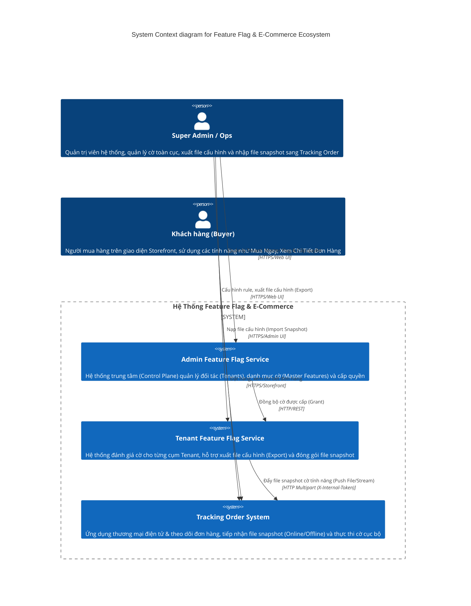
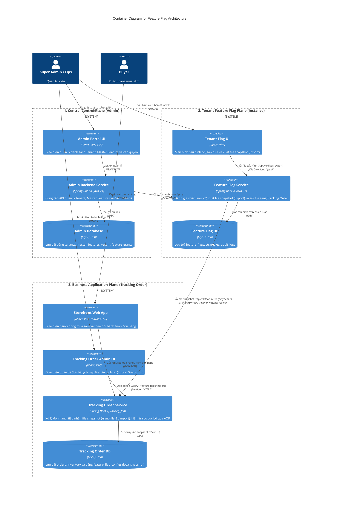
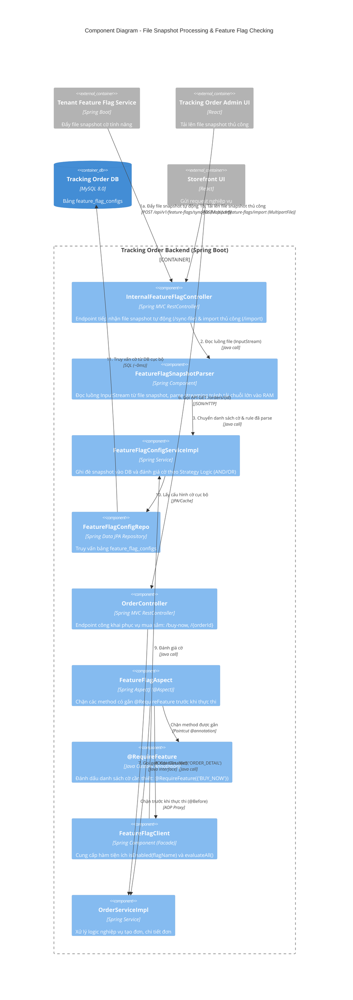
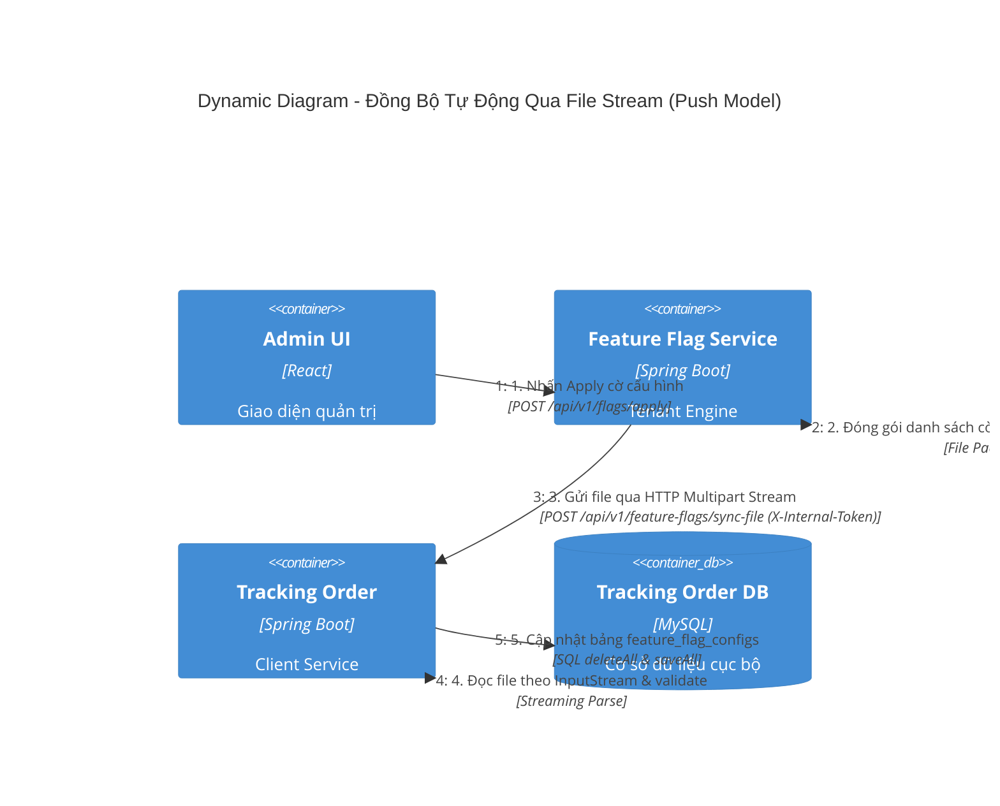
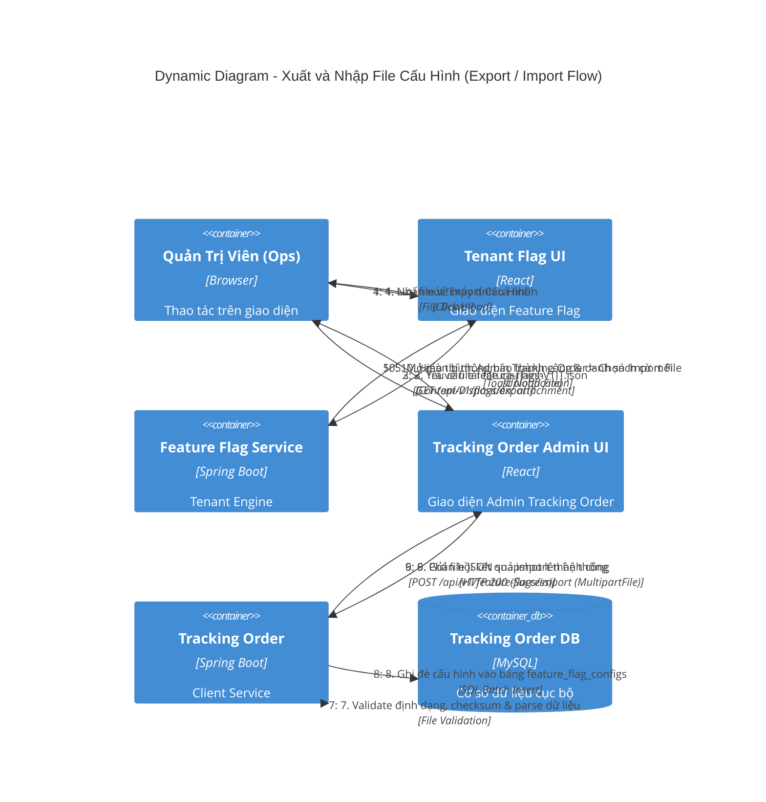
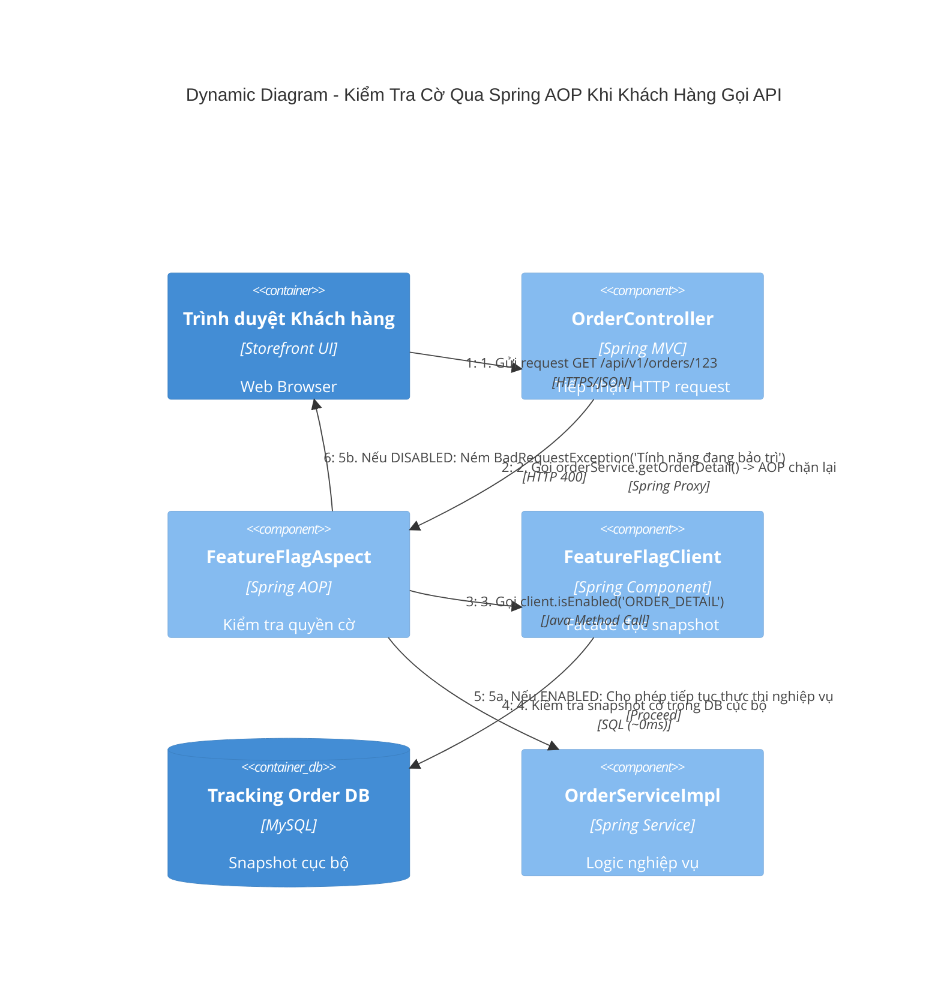

# Tài Liệu Kiến Trúc C4 - Hệ Thống Feature Flag

Hệ thống Feature Flag được thiết kế theo kiến trúc **Local Snapshot, File-Based Streaming & Air-Gapped Import (Không gọi chéo runtime)**. Giải pháp cho phép ứng dụng nghiệp vụ (`tracking-order`) kiểm tra cờ tính năng với độ trễ xấp xỉ **0ms**, đồng thời giải quyết triệt để bài toán **dữ liệu phình to khi tổ chức có hàng nghìn user** bằng cơ chế đồng bộ dạng file (File-based Sync & Export/Import).

---

## 1. System Context Diagram (Level 1 - C4Context)

Mô tả bức tranh tổng thể về các tác nhân (Actors) và các hệ thống lớn trong toàn bộ giải pháp, thể hiện cả luồng đồng bộ tự động qua file và luồng xuất/nhập file thủ công.

---

## 2. Container Diagram (Level 2 - C4Container)

Mô tả chi tiết các ứng dụng (Containers), cơ sở dữ liệu và giao thức kết nối. Kiến trúc hỗ trợ cả 2 hình thức đồng bộ file:
1. **Online File Sync**: Gửi file snapshot qua HTTP Multipart/Stream giữa 2 service.
2. **Offline File Sync**: Xuất file (`.json`) từ Flag Service mang sang nhập vào Admin Tracking Order.

---

## 3. Component Diagram (Level 3 - C4Component)

Đi sâu vào cấu trúc bên trong của Container **Tracking Order Service**, minh họa cách hệ thống tiếp nhận **File Snapshot** (tránh nghẽn RAM khi có hàng nghìn user), parse dữ liệu theo luồng `InputStream` và lưu vào DB cục bộ để Spring AOP kiểm tra với độ trễ 0ms.

---

## 4. Dynamic Diagram (Level 4 - C4Dynamic)

Minh họa chi tiết các luồng hoạt động đồng bộ dạng file:

### Luồng 1A: Đồng bộ tự động qua File Stream (Push File Model)
Thay vì gửi chuỗi JSON thô trong HTTP Body (gây nghẽn log và tốn RAM khi có hàng nghìn user), `feature-flag-service` đóng gói thành file và gửi qua HTTP Multipart Stream.

### Luồng 1B: Đồng bộ thủ công qua Export & Import File (Offline / Air-Gapped Flow)
Phục vụ trường hợp hệ thống Core Production bị cách ly mạng (chặn Inbound traffic từ ngoài), hoặc phục vụ quy trình phê duyệt (Approval Gate) / sao lưu & khôi phục.

### Luồng 2: Buyer gọi API và Spring AOP kiểm tra cờ cục bộ

---

## 5. Deployment Diagram (Level 5 - C4Deployment)

Mô hình triển khai thực tế trên môi trường Docker theo file `docker-compose.yml`:

---

## 6. Điểm Nổi Bật Về Mặt Kiến Trúc (Architecture Highlights)

1. **Zero-Latency In-Memory Evaluation**:
   * Khi người dùng gọi API nghiệp vụ (ví dụ mua hàng `buyNow`), ứng dụng `tracking-order` **hoàn toàn không gọi bất kỳ HTTP request nào** sang `feature-flag-service`.
   * Cờ được đọc trực tiếp từ bảng snapshot cục bộ `feature_flag_configs` trong cùng cơ sở dữ liệu.
2. **File-Based Streaming - Giải quyết bài toán tải lớn & hàng nghìn User**:
   * Khi quy mô tổ chức mở rộng với hàng nghìn user trong các strategy (`users_by_name`), payload JSON sẽ phình to từ hàng trăm KB đến nhiều MB.
   * Chuyển sang cơ chế **File Stream / Multipart**:
     * Tránh nghẽn log, không làm ngập console server bằng hàng vạn ký tự JSON thô.
     * Tối ưu bộ nhớ đệm (RAM): Phía `tracking-order` đọc file theo luồng `InputStream`, tránh tình trạng thư viện JSON tải toàn bộ chuỗi khổng lồ vào Heap Memory gây nghẽn Garbage Collection (GC Pause) hoặc OutOfMemory.
3. **Hỗ trợ Môi Trường Cách Ly Mạng (Air-Gapped & Zero-Trust Architecture)**:
   * Chức năng **Export File** (tại Feature Flag Service) và **Import File** (tại Admin Tracking Order) cho phép hệ thống vận hành hoàn hảo ngay cả khi Core Production bị đóng toàn bộ Inbound Ports từ bên ngoài.
4. **Quản Lý Phiên Bản & Khôi Phục An Toàn (Rollback Ready)**:
   * Mỗi file export là một bản snapshot độc lập (`feature-flags-{tenant}-{version}.json`). Nếu bản phát hành mới gặp sự cố, đội ngũ vận hành chỉ cần import lại file snapshot của phiên bản ổn định trước đó để đưa hệ thống về trạng thái an toàn ngay tức thì.
5. **Clean Separation of Concerns với Spring AOP**:
   * Code nghiệp vụ sạch sẽ, hoàn toàn tách biệt việc kiểm tra cờ khỏi code xử lý kinh doanh nhờ Custom Annotation `@RequireFeature` và `FeatureFlagAspect`.
6. **Bảo Mật Push Model**:
   * Giao tiếp tự động giữa `feature-flag-service` và `tracking-order` được bảo vệ bằng header bí mật `X-Internal-Token`.
