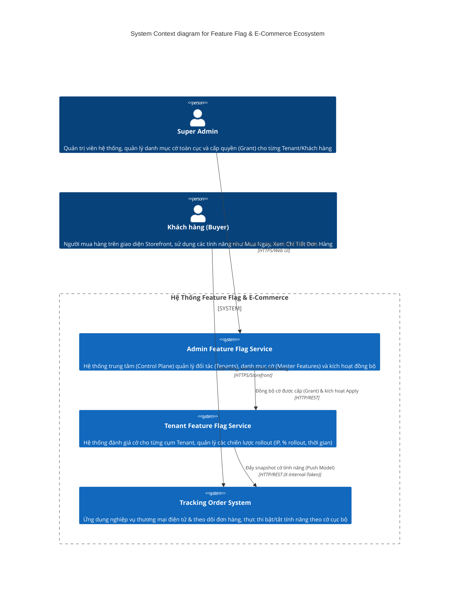
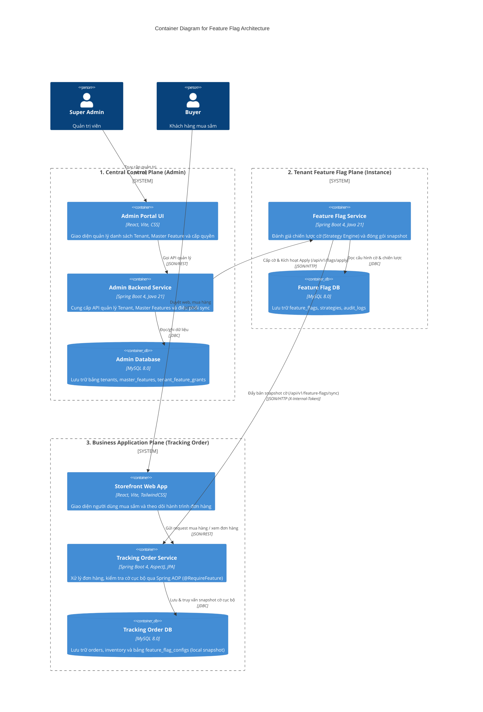
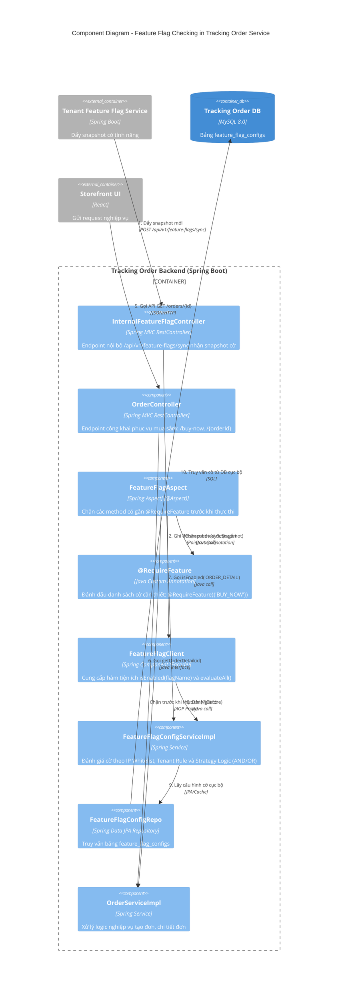
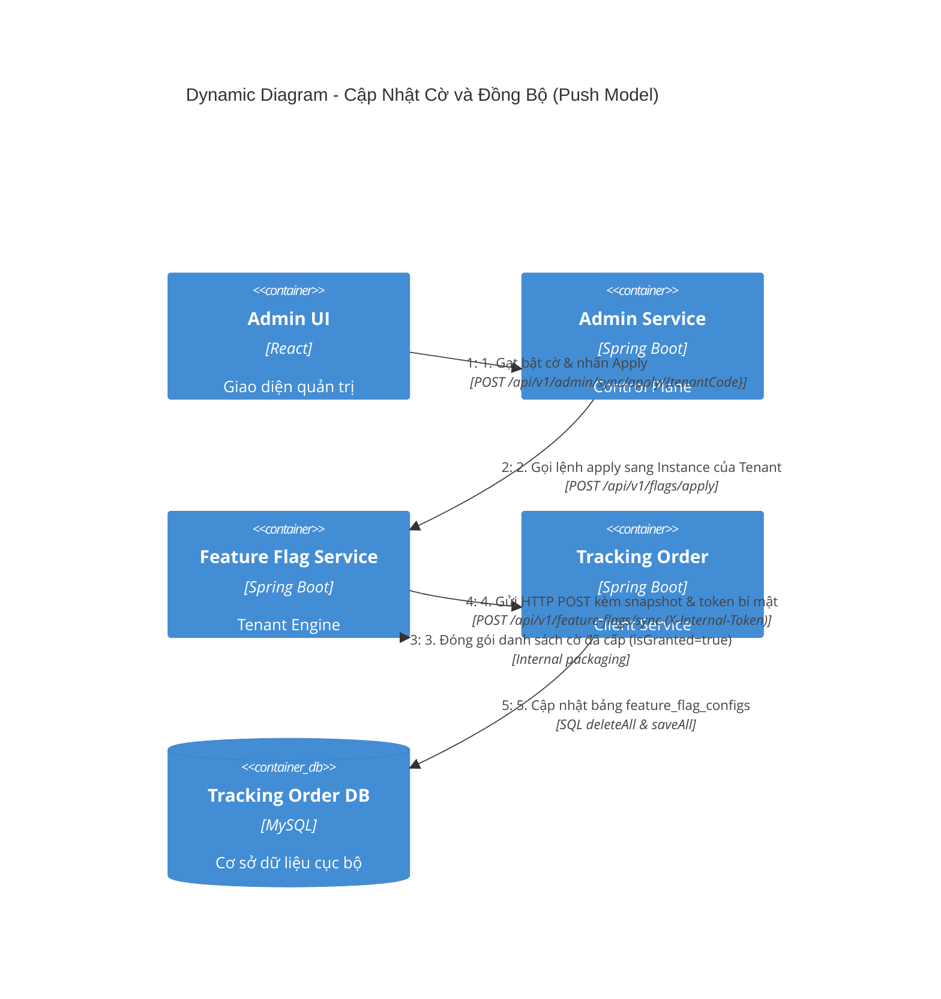
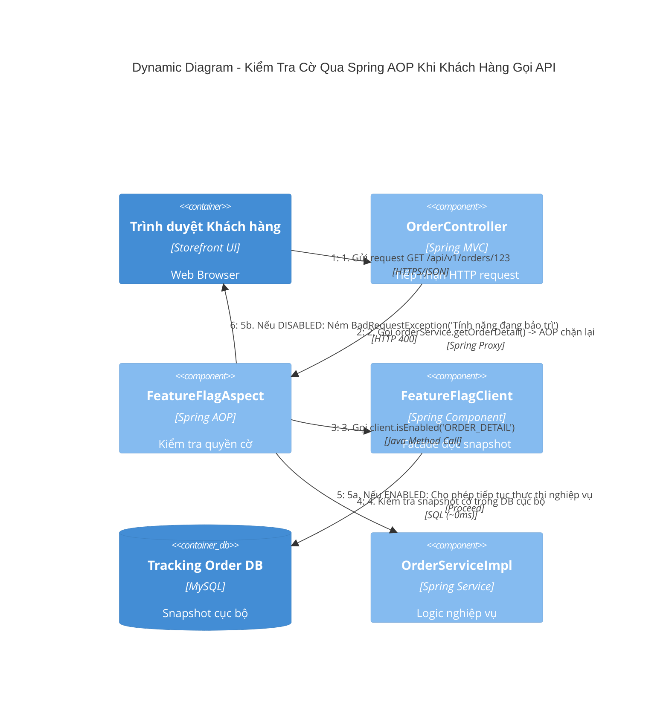
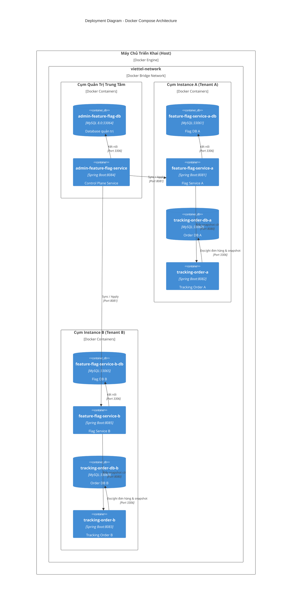

# Tài Liệu Kiến Trúc C4 - Hệ Thống Feature Flag

Hệ thống Feature Flag được thiết kế theo kiến trúc **Local Snapshot & Push Model (Không gọi chéo runtime)**, cho phép các ứng dụng nghiệp vụ (như `tracking-order`) kiểm tra cờ tính năng với độ trễ xấp xỉ **0ms**, độc lập với Feature Flag Service khi runtime.

---

## 1. System Context Diagram (Level 1 - C4Context)

Mô tả bức tranh tổng thể về các tác nhân (Actors) và các hệ thống lớn trong toàn bộ giải pháp.

---

## 2. Container Diagram (Level 2 - C4Container)

Mô tả chi tiết các ứng dụng (Containers), cơ sở dữ liệu và giao thức kết nối giữa các phân hệ theo mô hình Docker Compose đa phân hệ.

---

## 3. Component Diagram (Level 3 - C4Component)

Đi sâu vào cấu trúc bên trong của Container **Tracking Order Service**, minh họa cách Spring AOP, Custom Annotation và Local Snapshot phối hợp để kiểm tra cờ mà **không cần gọi ra ngoài mạng**.

---

## 4. Dynamic Diagram (Level 4 - C4Dynamic)

Minh họa luồng hoạt động đồng bộ và thực thi thực tế (Request Flow) từ lúc Admin bật cờ đến lúc người dùng sử dụng tính năng.

### Luồng 1: Admin cập nhật cờ và đồng bộ sang Tracking Order

### Luồng 2: Buyer gọi API và Spring AOP kiểm tra cờ cục bộ

---

## 5. Deployment Diagram (Level 5 - C4Deployment)

Mô hình triển khai thực tế trên môi trường Docker theo file `docker-compose.yml`:

---

## 6. Điểm Nổi Bật Về Mặt Kiến Trúc (Architecture Highlights)

1. **Zero-Latency In-Memory Evaluation**:
   * Khi người dùng gọi API nghiệp vụ (ví dụ mua hàng `buyNow`), ứng dụng `tracking-order` **hoàn toàn không gọi bất kỳ HTTP request nào** sang `feature-flag-service`.
   * Cờ được đọc trực tiếp từ bảng snapshot cục bộ `feature_flag_configs` trong cùng cơ sở dữ liệu.
2. **Clean Separation of Concerns với Spring AOP**:
   * Code nghiệp vụ sạch sẽ, hoàn toàn tách biệt việc kiểm tra cờ khỏi code xử lý kinh doanh nhờ Custom Annotation `@RequireFeature` và `FeatureFlagAspect`.
3. **Multi-Tenancy Isolation (Cô Lập Khách Hàng)**:
   * Mỗi Tenant (Instance A, Instance B) sở hữu cơ sở dữ liệu và container riêng biệt, đảm bảo tính bảo mật và độc lập khi vận hành.
4. **Bảo Mật Push Model**:
   * Giao tiếp giữa `feature-flag-service` và `tracking-order` được bảo vệ bằng header bí mật `X-Internal-Token`.
